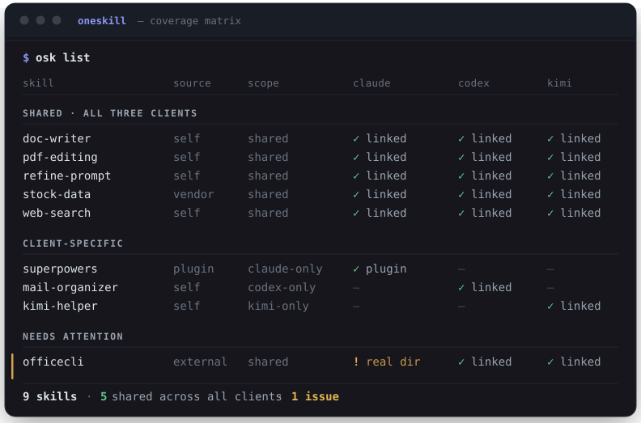

# oneskill

[](https://github.com/yxhuang/oneskill/actions/workflows/ci.yml)

**一份技能库,喂饱所有 AI 编程 CLI。**

[English](../README.md) | 简体中文

Claude Code、Codex CLI、Kimi CLI 都能加载 *skills*——带一个 `SKILL.md` 的文件夹,
教你的 agent 做某件具体的事,而且三家用的是同一种格式。问题在于:每个客户端只读
自己的目录。于是每个好用的技能都被复制三份,然后各份悄悄分叉——直到你想不起来
到底改的是哪一份。

`oneskill` 为每个技能只保留**一份本体**,用软链接进每个客户端。一条命令看清:
哪些三端共享、哪些是单端专属、哪些已经悄悄坏掉了。

<p align="center">
  
</p>

那行琥珀色就是这个工具存在的意义:某次客户端升级把软链替换成了真实目录,
Claude 从此用着一份不再跟随库更新的私有副本——肉眼根本发现不了。
`osk doctor` 会直接打出修复命令。

## 为什么需要它

软链农场会烂掉,而且烂得悄无声息:

- **客户端升级**会把软链覆盖成真实文件,悄悄分叉你的配置;
- **新技能**建在你当时恰好在用的那个客户端里,就永远留在那儿了;
- **卸载**留下指向空处的死链。

没有任何报错。你的 agent 只是安静地不再看到你写的技能——或者一直在用过期的副本。

## 快速开始

```bash
curl -fsSL https://raw.githubusercontent.com/yxhuang/oneskill/main/install.sh | sh

osk init          # 选定技能库的位置
osk scan --write  # 盘点你在所有客户端已有的全部技能
osk adopt --all   # 一次收编全部未纳管技能;每次移动前仍会确认
osk list          # 查看覆盖矩阵
```

已有技能会显示为 `unmanaged`(未纳管)。`osk adopt --all` 可以一次全部收编;
先用 `--dry-run` 预览,确认无误后也可加 `--yes` 做无人值守上手。你也可以按
`osk doctor` 给出的命令逐个处理——`osk adopt <路径>` 会把本体移入库中、原位换成
软链、并链入其余客户端。如果你曾把同一个技能手工复制到两个客户端,一次收编就会
把它们合而为一(多余副本会移到外置备份,绝不删除)。

要求 Python 3.9+。单文件、零依赖、无需构建。

## 一个面向 agent 技能的包管理器

直接从 GitHub 安装技能——一次装进你的所有客户端:

```bash
osk install gh:anthropics/skills/skills/skill-creator@main --review
osk update            # 重新拉取所有远程技能;仅在内容真有变化时升级
osk uninstall <name>  # 各端断链,本体保留为备份
```

下载走 GitHub tarball API,只用 Python 标准库——不需要 `git`。清单会记录每个技能的
来源、解析到的 commit 和安装时间,`osk list` 会显示锁定的版本号。

第三方技能就是第三方*提示词*:你的 agent 会照着里面写的做。`--review` 会在安装前
打印完整的 `SKILL.md`。只从你信任的来源安装。

## 命令一览

| 命令 | 作用 |
|---|---|
| `osk list` | 全客户端覆盖矩阵,`--json` 输出机器可读格式 |
| `osk doctor` | 检出漂移:断链、被遮蔽的软链、与清单不符。只读——只打印修复命令,绝不代跑 |
| `osk adopt <路径>` / `osk adopt --all` | 收编一个客户端技能,或一次收编全部未纳管技能 |
| `osk install <源>` | 从本地目录或 `gh:owner/repo[/子目录][@ref]` 安装 |
| `osk update [名字]` | 更新一个或全部远程技能 |
| `osk uninstall <名字>` | 各端断链;本体保留为带时间戳的备份 |
| `osk sync` | 按清单对账现实,幂等 |
| `osk scan --write` | 按当前环境生成清单 |
| `osk init` | 首次配置 |

## 工作原理

一个目录存放所有技能本体,各客户端的 skills 目录里全是指向它的软链。
清单记录*应有*的状态——于是漂移变成一次 diff,而不是靠猜。

```
  ~/skill-library/pdf-editing/SKILL.md   ← 唯一的真实副本
        ↑              ↑            ↑
  ~/.claude/     ~/.codex/    ~/.kimi-code/
    skills/        skills/       skills/
```

## 它从不删除任何东西

管理软链农场意味着要移动真实目录,所以 `oneskill` 把自己设计得毫不吓人:

- **每个破坏性步骤都先询问**,并展示涉及的完整路径;
- **冲突一律改名,绝不删除**。客户端副本会移出各客户端的加载路径,落到
  `~/.oneskill/backups/<客户端>/<名字>.oneskill-backup-<时间戳>`;库内本体仍在
  原目录旁保留带时间戳的备份。整个代码库里没有一个 `rmtree`;
- **处处支持 `--dry-run`**,只打印完整计划,不动任何东西;
- **失败的操作会回滚**到起点;
- **`list` 和 `doctor` 严格只读。**

设计准则:糟糕的一天最多让你损失一次重命名,永远不会损失一个文件。

## 常见问题

**它是自动的吗?会监听我的技能目录吗?**
不会——这是有意为之。没有守护进程、没有监听器、没有后台任务。你整个技能环境的
状态永远只差一条 `osk list`,每个修复都是一条现成的命令。如果你本来就在用 AI
agent 干活,最地道的用法是在 agent 的规则文件(`CLAUDE.md`、`AGENTS.md`……)里加
一行:*"新建或安装技能后,运行 `osk adopt <路径>`"*——让 agent 替你维护技能库,
这比任何文件监听器都可靠。

**我的技能已经散落各处,上手有多痛苦?**
`osk scan --write` 一次盘点全部,接着 `osk adopt --all` 收编所有未纳管技能。不加
`--yes` 时,每次移动仍会逐项确认。同一技能的多端手工副本会合并为一份共享本体,
多余副本安全备份到客户端 skills 目录之外。如果你想逐个处理,`osk doctor` 也会按
技能去重,每个技能只打印一条 `adopt` 命令。

**能加别的客户端吗(Gemini CLI、Copilot CLI……)?**
能——客户端路径集中在 `bin/osk` 顶部的一个映射结构里。加一条,所有
scan/list/sync/install 路径自动生效。

**为什么 Claude Code 的插件技能不共享?**
它们住在带版本号的缓存路径里,插件一升级软链就断;内容也深度绑定 Claude 专有
工具。`oneskill` 如实把它们标为 `claude-only`,而不是假装能共享。

## 项目状态

年轻,但对此很诚实:安全性质有 35 个离线测试背书,CI 覆盖 Linux/macOS ×
Python 3.9/3.13——但它目前只在少数环境上跑过。来自第二台机器的 bug 报告
对我们真的很有价值。

```bash
python3 -m unittest discover -s tests
```

已实现:批量收编 `adopt --all`(一条命令完成上手)。路线图:更多客户端支持、以及
基于 `osk list --json` 的 GUI(JSON 键已稳定,可放心对接)。

## 许可证

MIT
